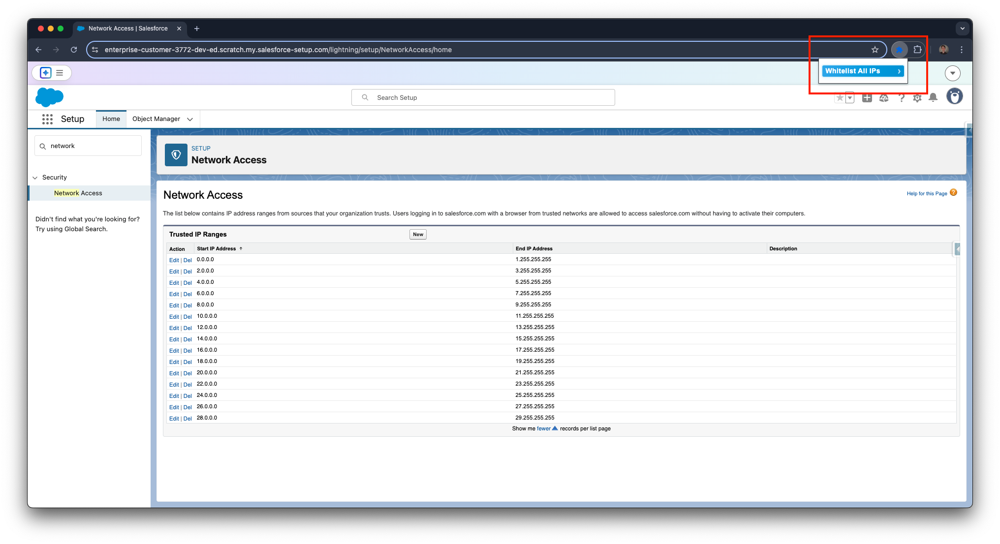

# Salesforce Whitelist All IPs 
  - Browser extension to Whitelist all IPs for Salesforce.
  - Removes the email code verification on login.

## Key Features
  - Whitelist all IP ranges

## Installation
  - `Clone`/`Fork`/`Download` this repository to your machine
  - Navigate to ```chrome://extensions/```
    - Enable `Developer mode` on the top right
    - Click `Load unpacked` on the top left
      - Select the repository root folder
  - Might need a page refresh or browser restart

## Usage
  - Go to the `Security`/`Network Access` on Setup Home
  - Use the action to generate the following ranges
    
